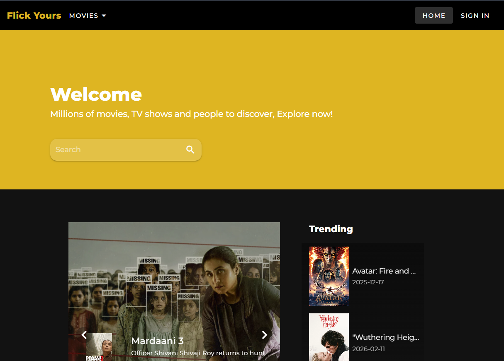
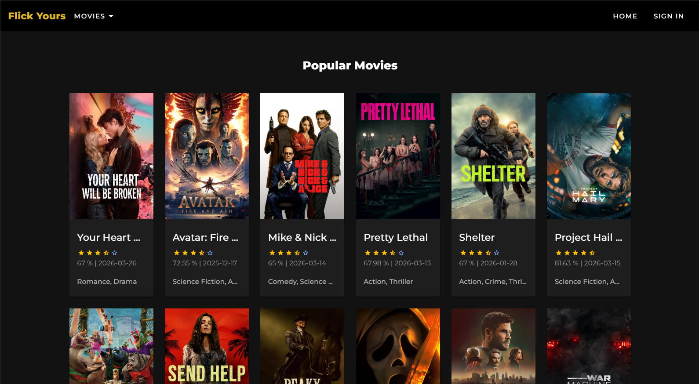
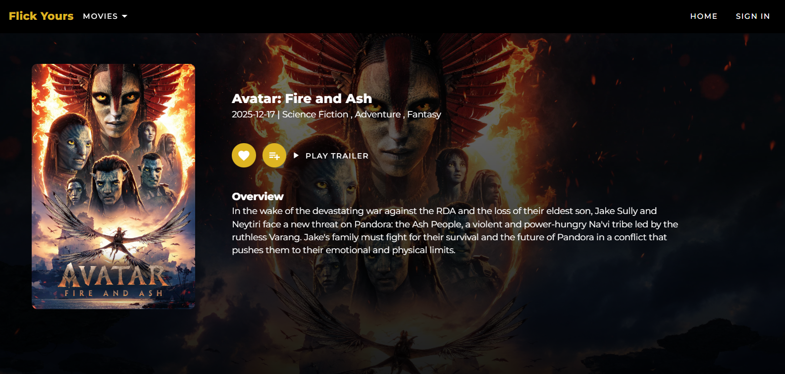

# 🎬 Movie Discovery App

A web application that allows users to explore movies, view ratings, and read detailed information using data from TMDB API.

---

## 🚀 Features

- 🎥 Browse popular movies
- 🔍 Search movies by title
- ⭐ View movie ratings and details
- 📝 Display synopsis and release date
- 🎭 Filter movies by category (optional)
- 📱 Responsive UI with Vuetify
- ⚡ Fast API data fetching

---

## 🏗️ Tech Stack

- **Frontend**: Vue.js
- **UI Framework**: Vuetify
- **API**: TMDB (The Movie Database)
- **HTTP Client**: Axios

---

## 🧠 How It Works

1. Application fetches movie data from TMDB API
2. Movies are displayed in a responsive grid layout
3. Users can search for specific movies
4. Clicking a movie shows detailed information
5. Data is dynamically rendered based on API response

---

## 📸 Demo

### 🖥️ Home 


### 🔍 All Movies List


### 🎬 Movie Detail


---

## 🧪 Example Use Case

Users can explore trending movies and search for specific titles to view ratings, synopsis, and release information in a clean and interactive interface.

---

## ▶️ Run Locally

### 1. Clone repository
```bash
git clone https://github.com/renattaaa/movie-discovery-app.git
cd movie-discovery-app